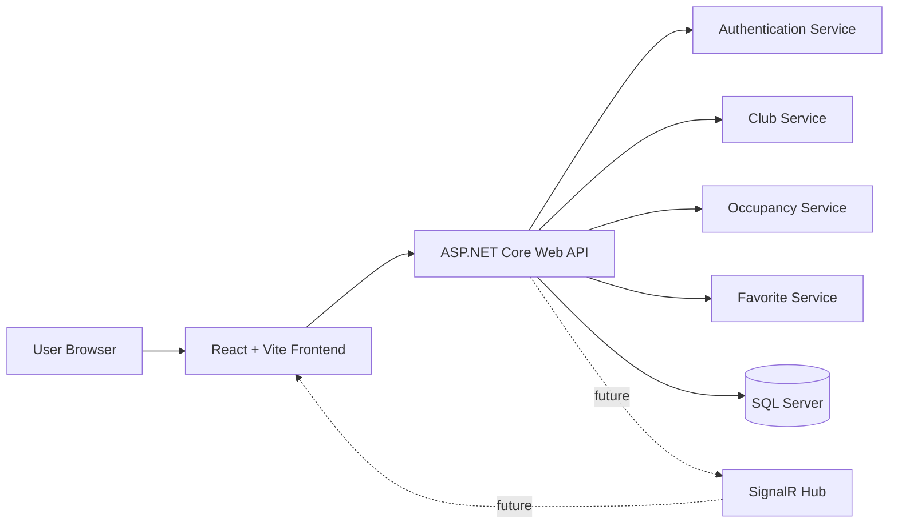

# Architecture

GoodLife Pulse Tracker uses a React frontend, an ASP.NET Core Web API, and a SQL Server database. The architecture is designed to support a simple first release while leaving clear extension points for real-time updates, analytics, reviews, notifications, and administration.

## System Overview



## Frontend

### Current Stack

- React
- Vite
- Tailwind CSS
- TypeScript/TSX

### Frontend Responsibilities

- Render club search and discovery screens.
- Show current estimated crowd status.
- Submit crowd reports through the API.
- Support authentication flows.
- Manage favorite clubs for signed-in users.
- Provide responsive layouts for mobile and desktop.

### Recommended Structure

```text
frontend/
  src/
    components/
    pages/
    services/
    hooks/
    context/
    assets/
```

TypeScript is the frontend standard so component props, API clients, and DTO mappings can be checked before runtime.

## Backend

### Stack

- ASP.NET Core Web API
- C#
- Entity Framework Core
- SQL Server
- JWT authentication

### Backend Responsibilities

- Expose REST endpoints for clubs, occupancy, reports, favorites, authentication, and later reviews.
- Validate incoming requests.
- Enforce authentication and user ownership.
- Calculate or retrieve current occupancy estimates.
- Persist application data through Entity Framework Core.
- Return consistent API responses and status codes.

### Recommended Structure

```text
backend/
  Controllers/
  Services/
  Data/
  Models/
  Dtos/
  Middleware/
  Configuration/
```

## Data Flow

### Club Discovery

1. The frontend requests clubs from `GET /api/clubs`.
2. The API applies search and filter parameters.
3. The API reads clubs and current occupancy snapshots from SQL Server.
4. The frontend renders the results with crowd status labels.

### Crowd Reporting

1. An authenticated user submits a report to `POST /api/clubs/{clubId}/reports`.
2. The API validates the club, user token, crowd level, and optional note.
3. The report is stored in `CrowdReports`.
4. The occupancy snapshot for the club is recalculated or updated.
5. In a later real-time phase, SignalR broadcasts the updated status to connected clients.

### Favorites

1. An authenticated user saves a club through `POST /api/favorites`.
2. The API verifies the user and club.
3. The database enforces one favorite per user and club.
4. The frontend can retrieve favorites from `GET /api/favorites`.

## Real-Time Strategy

The first implementation can use polling from the frontend. SignalR should be introduced when the backend and occupancy model are stable.

Real-time updates should publish:

- Club ID
- Current crowd level
- Last updated timestamp
- Optional confidence score

## Deployment Direction

- Local database: SQL Server running in Docker.
- Backend deployment: Azure App Service or equivalent.
- Frontend deployment: Azure Static Web Apps, Vercel, or another static hosting platform.
- CI/CD: GitHub Actions.
- Secrets: environment variables or managed cloud secret storage.

## Cross-Document Alignment

- Requirements define the product behaviors.
- API Design defines the HTTP contract for those behaviors.
- Database Schema defines persistence for the API.
- Project Roadmap defines the build order.
