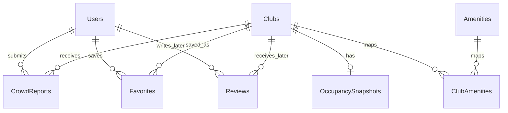

# Database Schema

GoodLife Pulse Tracker stores club data, users, crowd reports, current occupancy snapshots, and favorites in SQL Server. It also defines a planned future reviews model.

The schema is designed for Entity Framework Core migrations and should enforce relationships through foreign keys and unique constraints.

Reviews are shown as a planned future entity. The first release can ship without creating the `Reviews` table.

## Entity Relationship Overview



## Tables

### Users

Stores registered application users.

| Column | Type | Required | Notes |
| --- | --- | --- | --- |
| Id | int | Yes | Primary key, identity |
| DisplayName | nvarchar(100) | Yes | Public display name |
| Email | nvarchar(255) | Yes | Unique, normalized for lookup |
| PasswordHash | nvarchar(max) | Yes | Hashed password only |
| Role | nvarchar(50) | Yes | Default `User`; future `Admin` |
| CreatedAt | datetime2 | Yes | UTC |
| UpdatedAt | datetime2 | No | UTC |

Indexes:

- Unique index on `Email`.

### Clubs

Stores GoodLife Fitness club locations.

| Column | Type | Required | Notes |
| --- | --- | --- | --- |
| Id | int | Yes | Primary key, identity |
| Name | nvarchar(200) | Yes | Club name |
| AddressLine1 | nvarchar(200) | Yes | Street address |
| AddressLine2 | nvarchar(200) | No | Unit or additional address details |
| City | nvarchar(100) | Yes | First release focuses on Calgary |
| Province | nvarchar(50) | Yes | Example: `AB` |
| PostalCode | nvarchar(20) | No | Canadian postal code |
| PhoneNumber | nvarchar(30) | No | Club phone number |
| Latitude | decimal(9,6) | No | Used for map and distance features |
| Longitude | decimal(9,6) | No | Used for map and distance features |
| IsActive | bit | Yes | Hides closed or unsupported clubs |
| CreatedAt | datetime2 | Yes | UTC |
| UpdatedAt | datetime2 | No | UTC |

Indexes:

- Index on `City`.
- Index on `Province`.
- Index on `IsActive`.
- Optional composite index on `City`, `Province`, and `IsActive`.

### Amenities

Stores reusable amenity names.

| Column | Type | Required | Notes |
| --- | --- | --- | --- |
| Id | int | Yes | Primary key, identity |
| Name | nvarchar(100) | Yes | Example: `Weights`, `Cardio`, `Group Fitness` |

Indexes:

- Unique index on `Name`.

### ClubAmenities

Join table between clubs and amenities.

| Column | Type | Required | Notes |
| --- | --- | --- | --- |
| ClubId | int | Yes | Foreign key to `Clubs.Id` |
| AmenityId | int | Yes | Foreign key to `Amenities.Id` |

Constraints:

- Composite primary key on `ClubId`, `AmenityId`.

### OccupancySnapshots

Stores the current crowd estimate for each club. This table supports fast read endpoints without recalculating recent reports on every request.

| Column | Type | Required | Notes |
| --- | --- | --- | --- |
| Id | int | Yes | Primary key, identity |
| ClubId | int | Yes | Foreign key to `Clubs.Id`; unique |
| CrowdLevel | nvarchar(20) | Yes | `Empty`, `Moderate`, `Busy`, or `Packed` |
| ConfidenceScore | decimal(4,3) | No | Range `0.000` to `1.000` |
| ReportCountWindow | int | Yes | Number of recent reports used |
| LastUpdatedAt | datetime2 | Yes | UTC |

Indexes:

- Unique index on `ClubId`.
- Index on `CrowdLevel`.
- Index on `LastUpdatedAt`.

### CrowdReports

Stores user-submitted crowd reports.

| Column | Type | Required | Notes |
| --- | --- | --- | --- |
| Id | int | Yes | Primary key, identity |
| ClubId | int | Yes | Foreign key to `Clubs.Id` |
| UserId | int | Yes | Foreign key to `Users.Id` |
| CrowdLevel | nvarchar(20) | Yes | `Empty`, `Moderate`, `Busy`, or `Packed` |
| Note | nvarchar(500) | No | Optional user note |
| ReportedAt | datetime2 | Yes | UTC |

Indexes:

- Index on `ClubId`, `ReportedAt`.
- Index on `UserId`, `ReportedAt`.

### Favorites

Stores saved clubs for authenticated users.

| Column | Type | Required | Notes |
| --- | --- | --- | --- |
| Id | int | Yes | Primary key, identity |
| UserId | int | Yes | Foreign key to `Users.Id` |
| ClubId | int | Yes | Foreign key to `Clubs.Id` |
| CreatedAt | datetime2 | Yes | UTC |

Constraints:

- Unique index on `UserId`, `ClubId` so a user cannot save the same club twice.

Indexes:

- Index on `UserId`.
- Index on `ClubId`.

### Reviews

Reviews are planned for a later phase. The table can be introduced when the feature is implemented.

| Column | Type | Required | Notes |
| --- | --- | --- | --- |
| Id | int | Yes | Primary key, identity |
| UserId | int | Yes | Foreign key to `Users.Id` |
| ClubId | int | Yes | Foreign key to `Clubs.Id` |
| Rating | int | Yes | Range `1` to `5` |
| Comment | nvarchar(1000) | No | Review text |
| CreatedAt | datetime2 | Yes | UTC |
| UpdatedAt | datetime2 | No | UTC |

Constraints:

- Check constraint on `Rating` between `1` and `5`.
- Optional unique index on `UserId`, `ClubId` if the product allows one review per user per club.

## Enum Storage

Crowd levels should be stored as strings for readability and easier debugging:

```text
Empty
Moderate
Busy
Packed
```

The backend should validate accepted values at the DTO and domain-service levels.

## Seed Data

Local development should include seed data for:

- A small set of Calgary GoodLife Fitness clubs.
- Common amenities.
- Club amenity relationships.
- Optional test user account for local development only.
- Initial occupancy snapshots for each seeded club.

Do not seed real user passwords or production credentials.

## Deletion Rules

- Deactivating a club should use `Clubs.IsActive = false` instead of deleting the row.
- Deleting a user should be handled carefully. In first release, prefer disabling accounts over hard deletion.
- Favorites can be hard deleted when a user removes a saved club.
- Crowd reports should generally be retained for analytics unless a moderation or privacy requirement says otherwise.

## Data Integrity Rules

- Every crowd report must belong to an existing user and club.
- Every favorite must belong to an existing user and club.
- Every occupancy snapshot must belong to one club.
- A club should have at most one current occupancy snapshot.
- Timestamp columns should use UTC.
